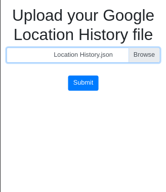
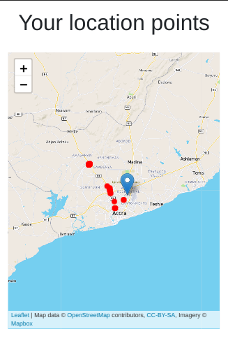
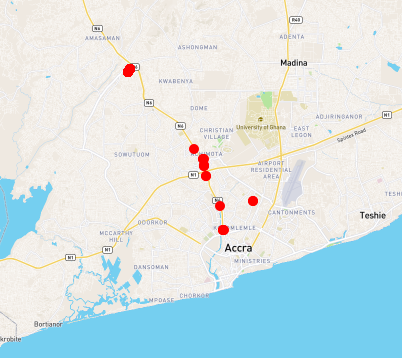
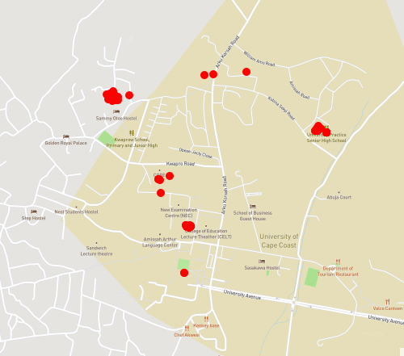
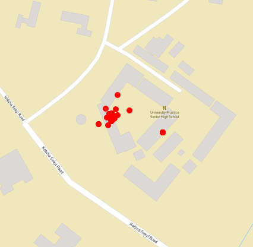
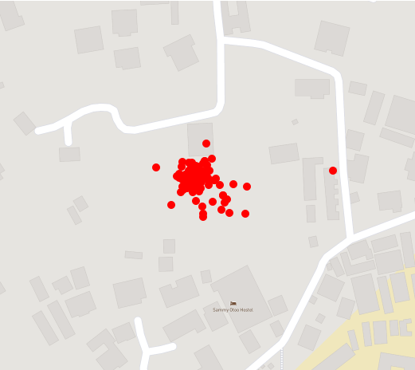

# location-points
My personal implementation of visualizing your Google account location history with a map

# Get started
1. Download your location history data in JSON format from Google (this may take up to a day to process)

# Usage

# Looks 

# Examples

